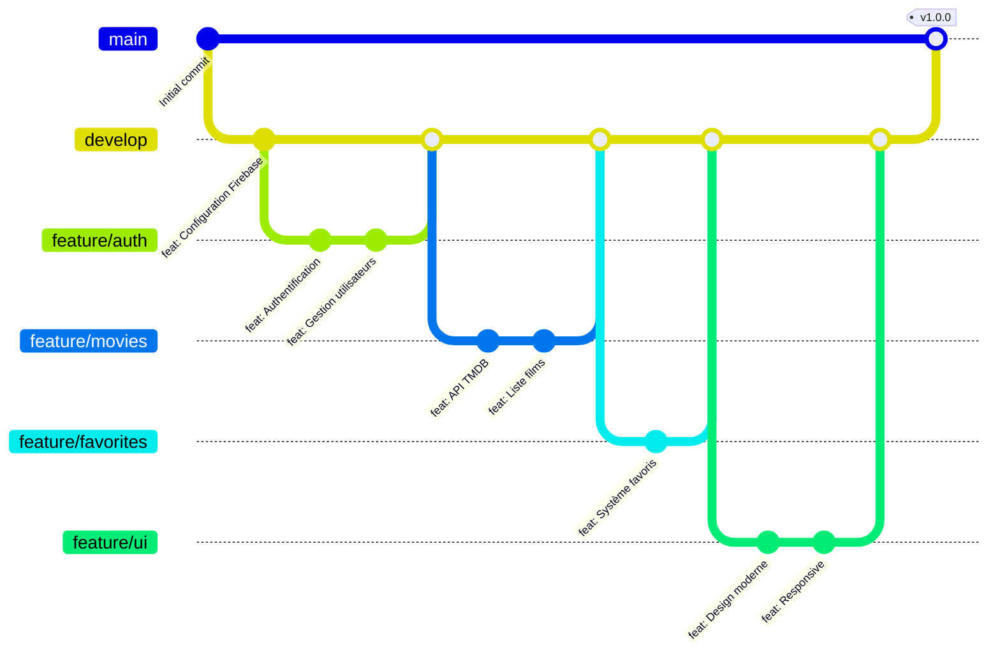

# Stratégie de Branches MovieStream



## Structure des Branches

### Branches Principales
- `main` : Code de production stable
- `develop` : Branche de développement principale

### Branches de Fonctionnalités
- `feature/auth` : Système d'authentification
- `feature/movies` : Intégration API TMDB
- `feature/favorites` : Gestion des favoris
- `feature/ui` : Interface utilisateur

### Branches de Support
- `bugfix/*` : Corrections de bugs
- `release/*` : Préparation des versions
- `hotfix/*` : Corrections urgentes en production

## Workflow de Développement

1. Création d'une branche de fonctionnalité depuis `develop`
   ```bash
   git checkout develop
   git checkout -b feature/new-feature
   ```

2. Développement et commits réguliers
   ```bash
   git add .
   git commit -m "feat: Description de la fonctionnalité"
   ```

3. Fusion dans `develop`
   ```bash
   git checkout develop
   git merge feature/new-feature
   ```

4. Préparation d'une release
   ```bash
   git checkout -b release/1.0.0
   # Tests et corrections finales
   git checkout main
   git merge release/1.0.0
   git tag -a v1.0.0 -m "Version 1.0.0"
   ```

## Conventions de Nommage

### Branches
- Features : `feature/nom-feature`
- Bugfixes : `bugfix/description-bug`
- Releases : `release/x.y.z`
- Hotfixes : `hotfix/description-fix`

### Tags
- Versions : `vX.Y.Z`
  - X : Version majeure
  - Y : Version mineure
  - Z : Patch
